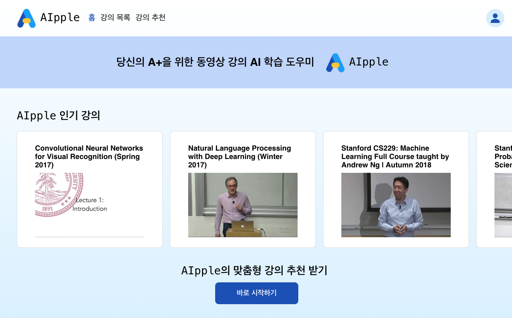

# AIpple

## 🚀 슬로건

<aside>
💡 당신의 A+을 위한 동영상 강의 AI 학습 도우미

</aside>

## 👩‍💻👨‍💻 개발 팀원

- [김성아](https://www.notion.so/382c2e0466fd4d999ba930f53312be6a?pvs=21) : 한양대학교 컴퓨터소프트웨어학부 20학번
- [최우정](https://www.notion.so/7e850dd1e74149cc8d9374161001e109?pvs=21) : KAIST 화학과 21학번

## ⚙️ 개발 환경

- FE: React (typescript, CSS)
- BE: Django, MySQL

## ℹ️ 애플리케이션 설명

## 주요 기능

- 동영상 강의 학습을 도와주는 서비스입니다.
- 관심사를 바탕으로 데이터베이스에 있는 강의 중 추천 강의를 제공합니다.
- **자체** 인공지능 모델을 이용해서 동영상 강의의 요약본을 생성합니다.
- **자체** 인공지능 모델을 이용해서 동영상 강의의 복습 문제를 생성합니다.
- 생성된 요약본에 강의를 들으며 필기를 추가하거나 수정할 수 있고 이는 데이터베이스에 저장됩니다.
- 마이페이지에서 자신이 수강 중인 강의와 요약본 및 필기를 다시 확인할 수 있습니다.
- 자신이 원하는 동영상 강의를 추가하고 요약본 및 필기, 복습 문제를 제공받을 수 있습니다.
- 반응형 웹으로, 창 크기에 맞춰 컴포넌트가 정렬됩니다.

## 1 로그인

### 1.1 주요 기능

- 로그인을 하지 않았을 때 사이트를 둘러 볼 수 있습니다.
- 학습하기 및 마이페이지는 로그인을 해야하는 기능이므로 로그인 창으로 넘어가게 됩니다.
- 회원가입시 이름, 아이디, 비밀번호를 입력받고 비밀번호는 해싱해서 저장합니다.

### 1.2 기술 설명

- User model을 만들어 회원가입과 로그인 view를 만듭니다.

## 2 홈

### 2.1 주요 기능

- 현재 많은 사람들이 수강하고 있는 인기 강의를 보여줍니다.
- 로고 또는 홈 탭을 누르면 홈 화면으로 이동합니다.

## 3  강의 목록

### 3.1 주요 기능

- 데이터베이스에 있는 강의들을 볼 수 있습니다.
- 듣고 싶은 강의를 검색할 수 있습니다.
- 목록에 없는 강의는 사용자가 직접 추가할 수 있습니다.

## 4 강의 추천

### 4.1 주요 기능

- 공부를 해보고 싶은데 어떻게 시작해야할지 모르는 사람들을 위해 강의를 추천합니다.
- 관심 분야를 묻는 질문을 바탕으로 강의를 추천합니다.
- 추천받은 강의를 바로 학습할 수 있습니다.

## 5 수강 페이지

### 5.1 주요 기능

- 강의 제목, 설명과 해당 강의의 목차에 따라 강의 영상을 제공합니다.
- 강의 영상을 볼 때 요약본 생성 버튼을 누르면 요약본이 생성되고 그 내용을 수정, 추가할 수 있습니다.
- 강의를 듣던 중간이나 다 들었을 때 필기 저장하기를 통해 저장할 수 있습니다.
- 학습 종료 버튼을 누르면 복습 문제가 생성되고 문제를 풀 수 있습니다.
- 답안을 제출하면 모법 답안을 확인할 수 있습니다.

### 5.2 기술 설명

- 요약본 생성
    - [Mistral-7B-Instruct-v0.2](https://huggingface.co/mistralai/Mistral-7B-Instruct-v0.2) 모델을 이용해서 instruction fine tuning하였습니다.
    - zero shot의 성능이 떨어져서 few shot learning으로 실험하여 성능을 높였습니다.
    - 2048개의 토큰만 받을 수 있어서 강의 영상의 내용을 chapter 별로 나누는 기능을 구현했습니다.
    - 영상의 자막을 chapter 별로 나눈 후에도 2048개 이상의 토큰일 때는 최소로 나누면서 각 부분이 최대가 되도록 알고리즘을 구현했습니다.
    - 각 부분에 대한 요약 문장을 생성받아서 후처리를 거친 후 응답으로 제공합니다.
- 복습 문제 생성
    - [Mistral-7B-Instruct-v0.2](https://huggingface.co/mistralai/Mistral-7B-Instruct-v0.2) 모델을 이용해서 instruction fine tuning하였습니다.
    - 문제와 답을 적절하게 생성하도록 few shot learning 하였습니다.
    - 복습 문제 셋을 5개 생성해서 응답으로 제공합니다.
- 최적화
    - 한 모델을 가지고 사용자가 용납가능한 시간 안에 생성을 완료하기 위해 모델을 최적화하여 서빙했습니다.
    - transformers의 코드를 [Flash Attention](https://github.com/Dao-AILab/flash-attention)과 [Paged Attention](https://github.com/vllm-project/vllm)으로 최적화하였고 [bitsandbytes](https://github.com/TimDettmers/bitsandbytes)로 Quantization하였습니다.
    - 총 throughput을 증가시키기 위해 들어오는 request를 continuous batching할 수 있게 하였습니다.

## 6 마이 페이지

### 6.1 주요 기능

- 학습 중인 강의 목록을 볼 수 있습니다.
- 강의 목록에 들어가면 사용자가 저장한 필기 목록을 볼 수 있습니다.

### 6.2 기술 설명

- User와 Lecture, UserLecture 모델을 만들어 이들을 연동하여 필기를 저장하고 읽어옵니다.
